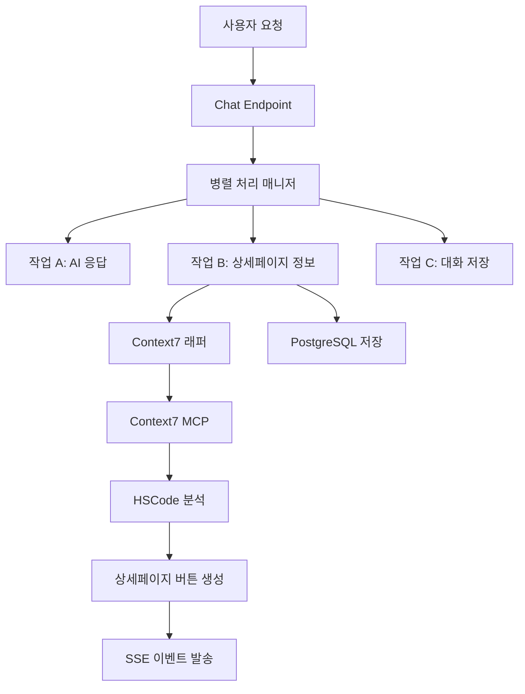

# 기술적 상세 설계 - HSCode 상세페이지 정보 준비

## 📋 개요
Context7을 활용한 작업 B (HSCode 상세페이지 정보 준비)의 상세 기술 설계를 정의합니다.

## 🏗️ 전체 아키텍처

### 시스템 구조도


### 핵심 컴포넌트

#### 1. **Context7AsyncWrapper** 
- Context7 MCP 도구의 비동기 래퍼
- 동기 호출을 비동기로 변환
- 에러 핸들링 및 재시도 로직

#### 2. **DetailPageService**
- HSCode 분석 및 상세페이지 정보 생성
- Context7 응답 데이터 검증 및 변환
- 버튼 우선순위 결정

#### 3. **ParallelTaskManager**
- 3단계 병렬 처리 조율
- 태스크 상태 관리 및 동기화
- 리소스 최적화

#### 4. **SSEEventGenerator**
- 실시간 이벤트 생성 및 전송
- 이벤트 순서 보장
- 클라이언트 연결 상태 모니터링

## 🔧 주요 컴포넌트 상세 설계

### 1. Context7AsyncWrapper

```python
from typing import Dict, Any, Optional
import asyncio
import functools
from contextlib import asynccontextmanager

class Context7AsyncWrapper:
    """Context7 MCP 도구의 비동기 래퍼"""
    
    def __init__(self, max_workers: int = 3, timeout: int = 30):
        self.max_workers = max_workers
        self.timeout = timeout
        self.executor = ThreadPoolExecutor(max_workers=max_workers)
    
    async def resolve_library_id_async(
        self, 
        library_name: str
    ) -> Dict[str, Any]:
        """라이브러리 ID 비동기 조회"""
        return await self._execute_with_timeout(
            mcp_context7_resolve_library_id,
            libraryName=library_name
        )
    
    async def get_library_docs_async(
        self,
        library_id: str,
        topic: Optional[str] = None,
        tokens: int = 3000
    ) -> Dict[str, Any]:
        """라이브러리 문서 비동기 조회"""
        return await self._execute_with_timeout(
            mcp_context7_get_library_docs,
            context7CompatibleLibraryID=library_id,
            topic=topic,
            tokens=tokens
        )
    
    async def _execute_with_timeout(self, func, **kwargs):
        """타임아웃과 함께 Context7 함수 실행"""
        loop = asyncio.get_event_loop()
        try:
            result = await asyncio.wait_for(
                loop.run_in_executor(
                    self.executor,
                    functools.partial(func, **kwargs)
                ),
                timeout=self.timeout
            )
            return result
        except asyncio.TimeoutError:
            raise Context7TimeoutError(f"Context7 호출 타임아웃: {func.__name__}")
        except Exception as e:
            raise Context7ApiError(f"Context7 API 오류: {str(e)}")
```

### 2. DetailPageService

```python
from typing import List, Optional, Dict, Any
from pydantic import BaseModel, ValidationError
import logging

class DetailPageInfo(BaseModel):
    """상세페이지 정보 모델"""
    hscode: Optional[str] = None
    detected_intent: str
    detail_buttons: List[DetailButton]
    processing_time_ms: int
    confidence_score: float
    analysis_source: str  # "context7" | "fallback" | "cache"
    
class DetailPageService:
    """상세페이지 정보 준비 서비스"""
    
    def __init__(self):
        self.context7_wrapper = Context7AsyncWrapper()
        self.cache = DetailPageCache()
        self.fallback_analyzer = FallbackHSCodeAnalyzer()
    
    async def prepare_detail_page_info(
        self,
        message: str,
        session_uuid: str,
        user_id: Optional[int] = None
    ) -> DetailPageInfo:
        """상세페이지 정보 준비 - 다단계 폴백 전략"""
        start_time = time.time()
        
        try:
            # 1단계: 캐시 확인
            cached_info = await self.cache.get(message)
            if cached_info:
                return cached_info
            
            # 2단계: Context7을 통한 분석
            try:
                context7_info = await self._analyze_with_context7(message)
                if context7_info.confidence_score >= 0.7:
                    await self.cache.set(message, context7_info)
                    return context7_info
            except (Context7TimeoutError, Context7ApiError) as e:
                logging.warning(f"Context7 분석 실패, 폴백 사용: {e}")
            
            # 3단계: 폴백 분석기 사용
            fallback_info = await self.fallback_analyzer.analyze(message)
            return fallback_info
            
        finally:
            processing_time = int((time.time() - start_time) * 1000)
            # 메트릭 기록
            self._record_metrics(processing_time, message)
    
    async def _analyze_with_context7(self, message: str) -> DetailPageInfo:
        """Context7을 사용한 HSCode 분석"""
        
        # HSCode 관련 라이브러리 조회
        fastapi_id = await self.context7_wrapper.resolve_library_id_async("fastapi")
        pydantic_id = await self.context7_wrapper.resolve_library_id_async("pydantic")
        
        # 관련 문서 조회
        fastapi_docs = await self.context7_wrapper.get_library_docs_async(
            "/tiangolo/fastapi",
            topic="background tasks streaming response"
        )
        
        # HSCode 패턴 추출 및 분석
        hscode_patterns = self._extract_hscode_patterns(message)
        confidence = self._calculate_confidence(hscode_patterns, fastapi_docs)
        
        # 상세페이지 버튼 생성
        detail_buttons = self._generate_detail_buttons(hscode_patterns)
        
        return DetailPageInfo(
            hscode=hscode_patterns[0] if hscode_patterns else None,
            detected_intent="hscode_search",
            detail_buttons=detail_buttons,
            processing_time_ms=0,  # 나중에 설정
            confidence_score=confidence,
            analysis_source="context7"
        )
```

### 3. ParallelTaskManager

```python
import asyncio
from typing import NamedTuple, AsyncGenerator
from dataclasses import dataclass

@dataclass
class ParallelTaskResults:
    """병렬 작업 결과"""
    ai_response_stream: AsyncGenerator[str, None]
    detail_page_info: Optional[DetailPageInfo]
    chat_saved: bool
    processing_times: Dict[str, int]

class ParallelTaskManager:
    """3단계 병렬 처리 매니저"""
    
    def __init__(self):
        self.detail_page_service = DetailPageService()
        self.sse_generator = SSEEventGenerator()
    
    async def execute_parallel_tasks(
        self,
        chat_request: ChatRequest,
        db: AsyncSession,
        background_tasks: BackgroundTasks
    ) -> AsyncGenerator[str, None]:
        """3단계 병렬 처리 실행"""
        
        # 즉시 병렬 처리 시작 이벤트 전송
        yield self.sse_generator.generate_thinking_event(
            "parallel_processing_start",
            "3단계 병렬 처리를 시작합니다",
            15
        )
        
        # 3개 작업을 동시에 시작
        task_a = asyncio.create_task(
            self._execute_ai_response(chat_request, db)
        )
        task_b = asyncio.create_task(
            self._execute_detail_page_preparation(chat_request)
        )
        task_c = asyncio.create_task(
            self._execute_chat_saving(chat_request, db)
        )
        
        # 상세페이지 버튼 준비 시작 이벤트
        yield self.sse_generator.generate_detail_buttons_start_event()
        
        # 각 작업 완료를 기다리며 결과 처리
        async for event in self._handle_task_completion(task_a, task_b, task_c):
            yield event
    
    async def _execute_detail_page_preparation(
        self, 
        chat_request: ChatRequest
    ) -> DetailPageInfo:
        """작업 B: 상세페이지 정보 준비"""
        try:
            detail_info = await self.detail_page_service.prepare_detail_page_info(
                chat_request.message,
                chat_request.session_uuid,
                chat_request.user_id
            )
            return detail_info
        except Exception as e:
            logging.error(f"상세페이지 정보 준비 실패: {e}")
            # 폴백 정보 반환
            return self._create_fallback_detail_info()
    
    async def _handle_task_completion(self, task_a, task_b, task_c):
        """작업 완료 처리 및 이벤트 생성"""
        detail_info = None
        
        # 작업 B 완료 대기 (상세페이지 정보)
        try:
            detail_info = await asyncio.wait_for(task_b, timeout=10.0)
            
            # 상세페이지 버튼 준비 완료 이벤트들 생성
            async for event in self.sse_generator.generate_detail_button_events(detail_info):
                yield event
                
        except asyncio.TimeoutError:
            logging.warning("상세페이지 정보 준비 타임아웃")
            yield self.sse_generator.generate_detail_buttons_timeout_event()
        
        # 작업 A 완료 대기 및 스트리밍 (AI 응답)
        ai_stream = await task_a
        async for chunk in ai_stream:
            yield chunk
        
        # 작업 C 완료 확인 (채팅 저장)
        try:
            await asyncio.wait_for(task_c, timeout=5.0)
        except asyncio.TimeoutError:
            logging.warning("채팅 저장 타임아웃")
```

### 4. SSEEventGenerator

```python
import json
from datetime import datetime
from typing import Dict, Any, AsyncGenerator

class SSEEventGenerator:
    """SSE 이벤트 생성기"""
    
    def generate_thinking_event(
        self, 
        stage: str, 
        content: str, 
        progress: int
    ) -> str:
        """thinking 단계 이벤트 생성"""
        data = {
            "stage": stage,
            "content": content,
            "progress": progress,
            "timestamp": datetime.utcnow().isoformat() + "Z"
        }
        return f"event: thinking\ndata: {json.dumps(data, ensure_ascii=False)}\n\n"
    
    def generate_detail_buttons_start_event(self) -> str:
        """상세페이지 버튼 준비 시작 이벤트"""
        data = {
            "type": "start",
            "buttonsCount": 3,
            "timestamp": datetime.utcnow().isoformat() + "Z"
        }
        return f"event: detail_page_buttons_start\ndata: {json.dumps(data)}\n\n"
    
    async def generate_detail_button_events(
        self, 
        detail_info: DetailPageInfo
    ) -> AsyncGenerator[str, None]:
        """상세페이지 버튼 준비 완료 이벤트들 생성"""
        
        for i, button in enumerate(detail_info.detail_buttons):
            button_data = {
                "type": "button",
                "buttonType": button.type,
                "priority": i + 1,
                "url": button.url,
                "title": button.label,
                "description": f"{button.type} 관련 정보",
                "isReady": True,
                "metadata": {
                    "hscode": detail_info.hscode,
                    "confidence": detail_info.confidence_score,
                    "source": detail_info.analysis_source
                }
            }
            
            yield f"event: detail_page_button_ready\ndata: {json.dumps(button_data, ensure_ascii=False)}\n\n"
            
            # 버튼 간 간격 (UX 개선)
            await asyncio.sleep(0.1)
        
        # 모든 버튼 준비 완료
        complete_data = {
            "type": "complete",
            "totalPreparationTime": detail_info.processing_time_ms
        }
        yield f"event: detail_page_buttons_complete\ndata: {json.dumps(complete_data)}\n\n"
```

## 🗄️ 데이터베이스 설계

### 확장된 chat_messages 스키마
```sql
-- 기존 스키마에 추가될 필드들
ALTER TABLE chat_messages ADD COLUMN IF NOT EXISTS 
    context7_analysis jsonb,           -- Context7 분석 결과
    detail_page_processing_time int,   -- 상세페이지 정보 준비 시간
    parallel_task_metrics jsonb;       -- 병렬 처리 메트릭
```

### JSON 스키마 예시
```json
{
  "hscode_analysis": {
    "detected_hscode": "8517.12.00",
    "confidence": 0.95,
    "analysis_source": "context7",
    "processing_time_ms": 1500,
    "detail_buttons": [
      {
        "type": "HS_CODE",
        "url": "/detail/hscode/8517.12.00",
        "priority": 1
      }
    ]
  },
  "context7_analysis": {
    "library_queries": ["fastapi", "pydantic"],
    "docs_retrieved": 2,
    "total_tokens": 3000,
    "api_calls": 3,
    "success_rate": 1.0
  },
  "parallel_task_metrics": {
    "task_a_duration": 2500,
    "task_b_duration": 1500,
    "task_c_duration": 800,
    "total_duration": 2500,
    "efficiency_ratio": 0.6
  }
}
```

## 🚀 성능 최적화 전략

### 1. **캐싱 전략**
- Context7 응답 결과 Redis 캐싱 (TTL: 1시간)
- HSCode 패턴별 결과 캐싱
- 사용자별 최근 쿼리 캐싱

### 2. **리소스 관리**
- Context7 API 호출 풀 관리 (최대 동시 호출 제한)
- 메모리 사용량 모니터링
- 백그라운드 태스크 큐 크기 제한

### 3. **에러 복구**
- Context7 API 장애 시 폴백 시스템
- 단계별 타임아웃 설정
- 부분 실패 시 우아한 성능 저하

## 📊 다음 단계

1. **JSON 응답 구조 상세 설계** (3단계 문서)
2. **구현 일정 및 마일스톤** (4단계 문서)
3. **테스트 전략 및 검증 방법** (5단계 문서) 