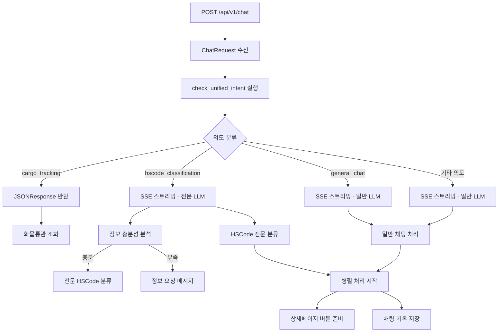

# /chat 엔드포인트 응답 형식 상세 분석 (v2.0)

## 목차
1. [개요](#개요)
2. [전체 흐름](#전체-흐름)
3. [응답 형식 분류](#응답-형식-분류)
4. [JSON 응답 형식](#json-응답-형식)
5. [SSE 스트리밍 응답 형식](#sse-스트리밍-응답-형식)
6. [HSCode 분류 처리](#hscode-분류-처리)
7. [병렬 처리 이벤트](#병렬-처리-이벤트)
8. [에러 처리](#에러-처리)

---

## 개요

`/api/v1/chat` 엔드포인트는 **2가지 응답 형식**을 제공합니다:

1. **JSON Response** - **화물통관 조회만** 해당
2. **SSE Streaming Response** - **HSCode 분류, 일반 채팅** 등 모든 경우

**주요 변경사항 (v2.0):**
- **HSCode 분류**: 정보 부족 시에도 JSON 응답 없이 SSE 스트리밍으로 정보 요청
- **SSE 이벤트 표준화**: 명확한 이벤트 네이밍 (`chat_*`, `parallel_*`, `detail_*`)
- **의도 분류 단순화**: 화물통관만 JSON, 나머지는 모두 SSE

---

## 전체 흐름



---

## 응답 형식 분류

### 1. 의도별 응답 형식

| 의도 타입               | 응답 형식  | LLM 모델                   | 특징                  |
| ----------------------- | ---------- | -------------------------- | --------------------- |
| `cargo_tracking`        | JSON       | -                          | 즉시 화물정보 추출    |
| `hscode_classification` | SSE Stream | hscode_llm_with_web_search | 전문 HSCode 분류      |
| `general_chat`          | SSE Stream | news_chat_model            | 일반 채팅 + 병렬 처리 |
| `news_inquiry`          | SSE Stream | news_chat_model            | 뉴스 질의 + 병렬 처리 |
| `regulatory_inquiry`    | SSE Stream | news_chat_model            | 규제 질의 + 병렬 처리 |

### 2. HSCode 분류 정보 충분성 처리

**이전 (v1.0)**: 정보 부족 시 JSON 응답으로 정보 요청  
**현재 (v2.0)**: 정보 부족 시에도 SSE 스트리밍으로 정보 요청

```python
# HSCode 분류는 항상 SSE 스트리밍으로 처리
elif intent_type == IntentType.HSCODE_CLASSIFICATION:
    logger.info("HSCode 분류는 SSE 스트리밍으로 처리하기 위해 일반 채팅으로 분류")
    return None  # SSE 스트리밍으로 처리
```

### 3. 응답 헤더

**JSON Response 헤더:**
```http
Content-Type: application/json; charset=utf-8
Access-Control-Allow-Origin: *
Access-Control-Allow-Methods: GET, POST, OPTIONS
Access-Control-Allow-Headers: Content-Type, Authorization, X-Requested-With
```

**SSE Streaming Response 헤더:**
```http
Content-Type: text/event-stream
Cache-Control: no-cache
Connection: keep-alive
Access-Control-Allow-Origin: *
Access-Control-Allow-Methods: GET, POST, OPTIONS
Access-Control-Allow-Headers: Content-Type, Authorization, X-Requested-With
Access-Control-Expose-Headers: Content-Type
Transfer-Encoding: chunked
X-Accel-Buffering: no
```

---

## JSON 응답 형식

### 화물통관 조회 전용 (cargo_tracking)

#### 성공 응답
```json
{
  "intent_type": "cargo_tracking",
  "status": "success",
  "message": "화물번호 'ABCD1234567'을(를) 인식했습니다. 통관 정보를 조회하고 있습니다.",
  "cargo_data": {
    "cargo_number": "ABCD1234567",
    "cargo_type": "컨테이너",
    "extracted_patterns": ["container"],
    "confidence_score": 0.95
  },
  "spring_endpoint": "/api/cargo/tracking",
  "session_uuid": "f8a67849-309e-41dd-af9a-77c0b861ec03",
  "user_id": 4,
  "processed_at": "2025-07-06T12:39:43.632Z",
  "processing_time_ms": 250,
  "error_code": null,
  "error_details": null
}
```

#### 에러 응답
```json
{
  "intent_type": "cargo_tracking",
  "status": "error",
  "error_code": "CARGO_NUMBER_NOT_FOUND",
  "error_message": "메시지에서 화물번호를 찾을 수 없습니다.",
  "original_message": "화물 조회해줘",
  "session_uuid": "f8a67849-309e-41dd-af9a-77c0b861ec03",
  "user_id": 4,
  "suggestions": [
    "화물번호를 정확히 입력해주세요.",
    "예시: ABCD1234567 (컨테이너 번호)",
    "예시: 1234-5678-9012 (추적번호)"
  ],
  "retry_available": true,
  "processed_at": "2025-07-06T12:39:43.632Z"
}
```

---

## SSE 스트리밍 응답 형식 (v2.0 표준화)

### 1. 기본 이벤트 구조

모든 SSE 이벤트는 명확한 이벤트 이름을 가집니다:

```
event: {event_name}
data: {json_data}

```

### 2. 표준화된 이벤트 순서

1. **chat_session_info** - 세션 정보
2. **chat_message_start** - 메시지 시작
3. **chat_metadata_start** - 메타데이터 블록 시작 (새 세션만)
4. **chat_metadata_stop** - 메타데이터 블록 종료 (새 세션만)
5. **chat_content_start** - 텍스트 블록 시작
6. **parallel_processing** - 병렬 처리 시작
7. **chat_content_delta** - 스트리밍 텍스트 청크 (연속)
8. **detail_buttons_start** - 상세페이지 버튼 준비 시작
9. **detail_button_ready** - 개별 버튼 준비 완료 (반복)
10. **detail_buttons_complete** - 모든 버튼 준비 완료
11. **chat_content_stop** - 텍스트 블록 종료
12. **chat_message_delta** - 메시지 메타데이터
13. **chat_message_limit** - 메시지 제한 정보
14. **chat_message_stop** - 메시지 종료

### 3. 이벤트 상세

#### chat_session_info
```
event: chat_session_info
data: {
  "session_uuid": "f8a67849-309e-41dd-af9a-77c0b861ec03",
  "timestamp": 1720263584.2559748
}

```

#### chat_message_start
```
event: chat_message_start
data: {
  "type": "message_start",
  "message": {
    "id": "chatcompl_a59ab9545bf64cd7b91afd27",
    "type": "message",
    "role": "assistant",
    "model": "claude-sonnet-4-20250514",
    "parent_uuid": "12345678-1234-5678-9012-123456789012",
    "uuid": "87654321-4321-8765-2109-876543210987",
    "content": [],
    "stop_reason": null,
    "stop_sequence": null
  }
}

```

#### chat_metadata_start/stop (새 세션 시)
```
event: chat_metadata_start
data: {
  "type": "content_block_start",
  "index": 0,
  "content_block": {
    "start_timestamp": "2025-07-06T12:39:43.629Z",
    "stop_timestamp": null,
    "type": "metadata",
    "metadata": {
      "session_uuid": "f8a67849-309e-41dd-af9a-77c0b861ec03"
    }
  }
}

```

#### chat_content_start
```
event: chat_content_start
data: {
  "type": "content_block_start",
  "index": 1,
  "content_block": {
    "start_timestamp": "2025-07-06T12:39:43.629Z",
    "stop_timestamp": null,
    "type": "text",
    "text": "",
    "citations": []
  }
}

```

#### chat_content_delta
```
event: chat_content_delta
data: {
  "type": "content_block_delta",
  "index": 1,
  "delta": {
    "type": "text_delta",
    "text": "안녕하세요! "
  }
}

```

#### chat_content_stop
```
event: chat_content_stop
data: {
  "type": "content_block_stop",
  "index": 1,
  "stop_timestamp": "2025-07-06T12:39:43.629Z"
}

```

#### chat_message_delta
```
event: chat_message_delta
data: {
  "type": "message_delta",
  "delta": {
    "stop_reason": "end_turn",
    "stop_sequence": null
  }
}

```

#### chat_message_limit
```
event: chat_message_limit
data: {
  "type": "message_limit",
  "message_limit": {
    "type": "within_limit",
    "resetsAt": null,
    "remaining": null,
    "perModelLimit": null
  }
}

```

#### chat_message_stop
```
event: chat_message_stop
data: {
  "type": "message_stop"
}

```

---

## HSCode 분류 처리

### 1. HSCode 의도 감지 시 SSE 스트리밍

HSCode 분류는 **항상 SSE 스트리밍**으로 처리됩니다. 정보 부족 시에도 JSON 응답이 아닌 SSE 스트리밍으로 정보를 요청합니다.

#### 정보 충분성 분석 후 처리

```python
# 정보 충분성 분석
is_sufficient, product_category, requirements = (
    self.hscode_classification_service.analyze_information_sufficiency(
        chat_request.message
    )
)

if not is_sufficient:
    # 정보 부족 시: 화이트리스트 검색 + 정보 요구사항 안내
    hscode_prompt = f"""
{self.hscode_classification_service.create_information_request_response(
    chat_request.message, product_category, requirements
)}

---

**🔍 초기 HSCode 검색 시도**

위의 상세 정보를 기다리는 동안, 현재 제공된 정보로 예상 HSCode 범위를 검색해보겠습니다...
"""
else:
    # 정보 충분 시: 전문 HSCode 분류 수행
    hscode_prompt = """
당신은 20년 경력의 세계적인 HSCode 분류 전문가입니다.

**Step-Back Analysis (분류 원칙 정의):**
HSCode 분류의 근본 원칙:
1. 관세율표 해석에 관한 통칙(GRI) 1-6호를 순서대로 적용
2. 호(Heading)의 용어와 관련 부/류의 주(Note) 규정 우선
3. 본질적 특성(Essential Character) 기준으로 판단
4. 최종 확정 전 위험 요소 평가 필수
"""
```

### 2. HSCode 정보 요청 메시지 예시

#### 전자제품 카테고리
```
event: chat_content_delta
data: {
  "type": "content_block_delta",
  "index": 1,
  "delta": {
    "type": "text_delta",
    "text": "안녕하세요! 😊 전자제품의 HSCode 분류를 도와드리겠습니다.\n\n전자제품은 기능과 기술 사양에 따라 HSCode가 크게 달라집니다.\n\n## 전자제품 HSCode 분류를 위한 상세 정보\n\n### 1. 핵심 기능 분석 (필수)\n- **주요 기능**: 통신, 컴퓨팅, 오디오, 비디오, 제어 등\n- **복합 기능**: 여러 기능이 있는 경우 본질적 특성 판단\n- **독립성**: 단독 사용 가능 여부"
  }
}

```

### 3. 전문 HSCode 분류 모델

HSCode 분류 시 `hscode_llm_with_web_search` 모델을 사용하여 화이트리스트 기반 웹 검색과 함께 전문적인 분류를 수행합니다.

---

## 병렬 처리 이벤트

### 1. 병렬 처리 시작
```
event: parallel_processing
data: {
  "stage": "parallel_processing_start",
  "content": "3단계 병렬 처리를 시작합니다: 자연어 응답, 상세페이지 준비, 회원 기록 저장",
  "progress": 15,
  "timestamp": "2025-07-06T14:44:04.298191Z"
}

```

### 2. 상세페이지 버튼 준비 시작
```
event: detail_buttons_start
data: {
  "type": "start",
  "buttonsCount": 3,
  "estimatedPreparationTime": 5000,
  "timestamp": "2025-07-06T14:44:54.642338Z",
  "processingInfo": {
    "context7_enabled": true,
    "fallback_available": true,
    "cache_checked": true
  }
}

```

### 3. 개별 버튼 준비 완료
```
event: detail_button_ready
data: {
  "type": "button",
  "buttonType": "HS_CODE",
  "priority": 1,
  "url": "/detail/hscode",
  "title": "HS Code 상세정보",
  "description": "관세율, 규제정보 등 상세 조회",
  "isReady": true,
  "metadata": {
    "hscode": null,
    "confidence": 0.4,
    "source": "fallback",
    "query_params": {
      "search": "냉동 피자를 미국에 수출하고싶어. HSCode가 뭐야"
    }
  },
  "actionData": {
    "queryParams": {
      "search": "냉동 피자를 미국에 수출하고싶어. HSCode가 뭐야"
    },
    "analytics": {
      "click_tracking": true,
      "conversion_target": "hs_code_detail_view"
    }
  }
}

```

### 4. 모든 버튼 준비 완료
```
event: detail_buttons_complete
data: {
  "type": "complete",
  "totalPreparationTime": 584,
  "buttonsGenerated": 2,
  "timestamp": "2025-07-06T14:44:55.473676Z",
  "summary": {
    "hscode_detected": null,
    "confidence_score": 0.4,
    "analysis_source": "fallback",
    "fallback_used": true,
    "cache_hit": false
  },
  "performance": {
    "context7_calls": 0,
    "context7_latency_ms": 0,
    "database_queries": 0,
    "total_processing_time": 584
  }
}

```

### 5. 버튼 준비 에러
```
event: detail_buttons_error
data: {
  "type": "error",
  "errorCode": "DETAIL_PAGE_TIMEOUT",
  "errorMessage": "상세페이지 정보 준비 시간 초과",
  "timestamp": "2025-07-06T14:44:55.473676Z",
  "fallbackActivated": true,
  "retryInfo": {
    "retryable": true,
    "retryAfter": 30,
    "maxRetries": 3
  }
}

```

---

## 에러 처리

### 1. 일반 에러 응답

```
event: chat_content_delta
data: {
  "type": "content_block_delta",
  "index": 1,
  "delta": {
    "type": "text_delta",
    "text": "AI 응답 생성 중 오류가 발생했습니다."
  }
}

```

```
event: chat_message_delta
data: {
  "type": "message_delta",
  "delta": {
    "stop_reason": "error",
    "stop_sequence": null
  }
}

```

### 2. 연결 해제 처리

```python
# 클라이언트 연결 상태 확인
if await request.is_disconnected():
    logger.info("클라이언트가 연결을 해제했습니다.")
    return
```

### 3. 취소 처리

```python
except asyncio.CancelledError:
    logger.info("스트리밍이 취소되었습니다.")
    if response_started and accumulated_response:
        logger.info(f"취소된 응답 내용 (일부): {accumulated_response[:200]}...")
```

---

## 로깅 및 디버깅

### 1. 의도 분류 로깅

```
통합 의도 분류 결과: hscode_classification, 신뢰도: 0.900
HSCode 분류 의도 감지됨 (SSE 스트리밍 처리): 신뢰도 0.900
HSCode 분류는 SSE 스트리밍으로 처리하기 위해 일반 채팅으로 분류
HSCode 전문 분류 프롬프트 적용됨
```

### 2. 응답 로깅

```
=== AI 응답 시작 ===
사용자 ID: 4
세션 UUID: f8a67849-309e-41dd-af9a-77c0b861ec03

=== AI 응답 완료 ===
사용자 ID: 4
세션 UUID: f8a67849-309e-41dd-af9a-77c0b861ec03
응답 길이: 1024
응답 내용: 안녕하세요! 스마트폰의 HSCode 분류를 도와드리겠습니다...
====================
```

---

## 클라이언트 구현 가이드 (v2.0)

### 1. SSE 이벤트 핸들러 (표준화된 이벤트명 사용)

```javascript
const eventSource = new EventSource('/api/v1/chat');

// 세션 정보
eventSource.addEventListener('chat_session_info', (event) => {
  const sessionInfo = JSON.parse(event.data);
  console.log('세션 UUID:', sessionInfo.session_uuid);
});

// 메시지 시작
eventSource.addEventListener('chat_message_start', (event) => {
  const messageData = JSON.parse(event.data);
  showTypingIndicator();
});

// 텍스트 스트리밍
eventSource.addEventListener('chat_content_delta', (event) => {
  const deltaData = JSON.parse(event.data);
  appendText(deltaData.delta.text);
});

// 병렬 처리 상태
eventSource.addEventListener('parallel_processing', (event) => {
  const processData = JSON.parse(event.data);
  updateProgress(processData.progress, processData.content);
});

// 상세 버튼 준비
eventSource.addEventListener('detail_button_ready', (event) => {
  const buttonData = JSON.parse(event.data);
  createDetailButton(buttonData);
});

// 메시지 완료
eventSource.addEventListener('chat_message_stop', (event) => {
  hideTypingIndicator();
  enableInputField();
});
```

### 2. JSON 응답 처리 (화물통관만)

```javascript
const response = await fetch('/api/v1/chat', {
  method: 'POST',
  headers: { 'Content-Type': 'application/json' },
  body: JSON.stringify(chatRequest)
});

const contentType = response.headers.get('content-type');

if (contentType?.includes('application/json')) {
  // 화물통관 조회 결과
  const jsonData = await response.json();
  if (jsonData.intent_type === 'cargo_tracking') {
    handleCargoTrackingResult(jsonData);
  }
} else if (contentType?.includes('text/event-stream')) {
  // SSE 스트리밍 처리
  handleSSEStream(response);
}
```

### 3. HSCode 정보 요청 인식

```javascript
eventSource.addEventListener('chat_content_delta', (event) => {
  const data = JSON.parse(event.data);
  const text = data.delta.text;
  
  // HSCode 정보 요청 메시지 감지
  if (text.includes('HSCode 분류를 도와드리겠습니다') || 
      text.includes('상세 정보')) {
    showHSCodeInfoRequestUI();
  }
  
  appendText(text);
});
```

---

## 성능 최적화

### 1. 스트리밍 최적화

- **청크 크기**: 10자 단위
- **백프레셔 방지**: `await asyncio.sleep(0.001)`
- **버퍼링 비활성화**: `X-Accel-Buffering: no`

### 2. 전문 LLM 모델 사용

- **HSCode 분류**: `hscode_llm_with_web_search` (화이트리스트 검색 포함)
- **일반 채팅**: `news_chat_model`

### 3. 병렬 처리

- **AI 응답 스트리밍**과 **상세페이지 준비** 동시 실행
- **채팅 기록 저장** 백그라운드 처리

---

## 요약

### 주요 변경사항 (v2.0)

1. **HSCode 처리 개선**: 모든 HSCode 분류를 SSE 스트리밍으로 처리
2. **SSE 이벤트 표준화**: 명확한 이벤트 네이밍 컨벤션 적용
3. **JSON 응답 단순화**: 화물통관 조회만 JSON 응답
4. **전문 LLM 활용**: HSCode 분류 시 전문 모델 사용
5. **병렬 처리 개선**: 상세페이지 버튼과 AI 응답 병렬 처리

### 응답 분기 (최종)

- **화물통관 조회**: JSON 응답
- **HSCode 분류**: SSE 스트리밍 (정보 요청 포함)
- **일반 채팅**: SSE 스트리밍 + 병렬 처리
- **뉴스/규제 질의**: SSE 스트리밍 + 병렬 처리

모든 SSE 이벤트는 표준화된 네이밍을 사용하며, 프론트엔드에서 쉽게 파싱할 수 있도록 개선되었습니다. 