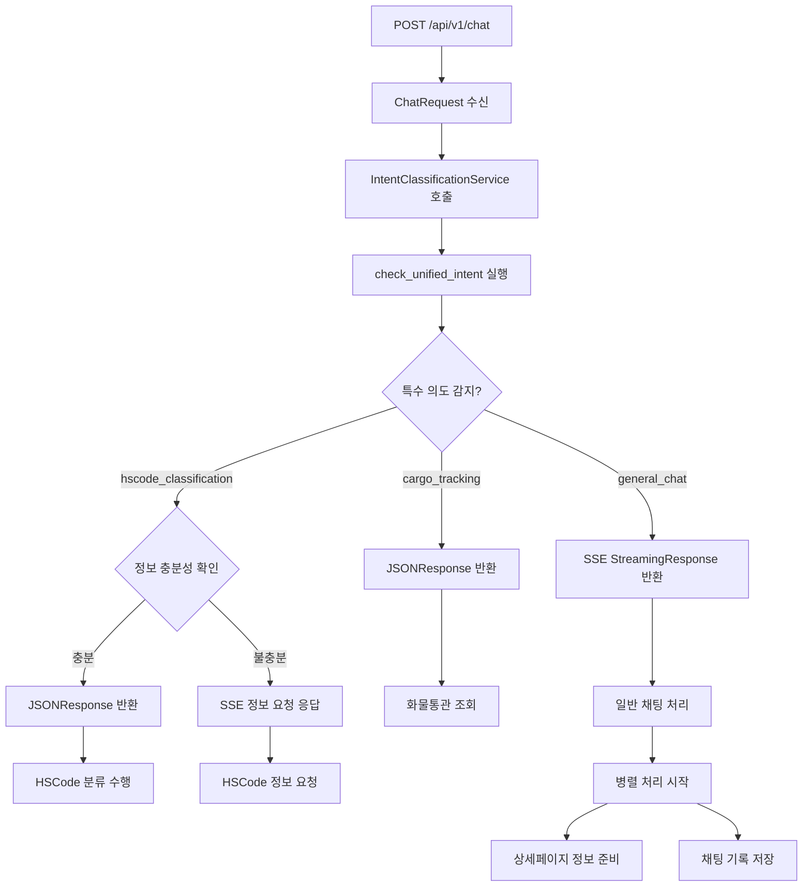

# /chat 엔드포인트 응답 형식 상세 분석

## 목차
1. [개요](#개요)
2. [전체 흐름](#전체-흐름)
3. [응답 형식 분류](#응답-형식-분류)
4. [JSON 응답 형식](#json-응답-형식)
5. [SSE 스트리밍 응답 형식](#sse-스트리밍-응답-형식)
6. [HSCode 분류 정보 요청 응답](#hscode-분류-정보-요청-응답)
7. [에러 처리](#에러-처리)
8. [병렬 처리 이벤트](#병렬-처리-이벤트)

---

## 개요

`/api/v1/chat` 엔드포인트는 **2가지 응답 형식**을 제공합니다:
1. **JSON Response** - 화물통관 조회 및 충분한 정보가 있는 HSCode 분류 시
2. **SSE Streaming Response** - 일반 채팅 및 HSCode 분류 정보 요청 시

응답 형식은 의도 분류 결과와 정보 충분성에 따라 자동으로 결정됩니다.

---

## 전체 흐름



---

## 응답 형식 분류

### 1. 의도 분류 및 정보 충분성 기준

| 의도 타입               | 정보 상태 | 응답 형식  | 처리 서비스                 |
| ----------------------- | --------- | ---------- | --------------------------- |
| `cargo_tracking`        | 항상 적용 | JSON       | CargoTrackingService        |
| `hscode_classification` | 정보 충분 | JSON       | HSCodeClassificationService |
| `hscode_classification` | 정보 부족 | SSE Stream | 특별한 정보 요청 메시지     |
| `general_chat`          | 항상 적용 | SSE Stream | ChatService                 |
| `news_inquiry`          | 항상 적용 | SSE Stream | ChatService                 |
| `regulatory_inquiry`    | 항상 적용 | SSE Stream | ChatService                 |

### 2. HSCode 분류 정보 충분성 판단 기준

**정보 부족으로 판단되는 경우:**
- 기본적인 키워드만 있고 상세 정보가 없는 경우
- 메시지 길이가 30자 이하인 경우
- 제품명만 있고 기술적 사양이나 용도 정보가 없는 경우

**정보 충분으로 판단되는 경우:**
- 제품의 상세 사양, 용도, 재료 등이 포함된 경우
- 모델명, 제조사, 기능 등의 구체적 정보가 포함된 경우

### 3. 응답 헤더

**JSON Response 헤더:**
```http
Content-Type: application/json; charset=utf-8
Access-Control-Allow-Origin: *
Access-Control-Allow-Methods: GET, POST, OPTIONS
Access-Control-Allow-Headers: Content-Type, Authorization, X-Requested-With
```

**SSE Streaming Response 헤더:**
```http
Content-Type: text/event-stream
Cache-Control: no-cache
Connection: keep-alive
Access-Control-Allow-Origin: *
Access-Control-Allow-Methods: GET, POST, OPTIONS
Access-Control-Allow-Headers: Content-Type, Authorization, X-Requested-With
Access-Control-Expose-Headers: Content-Type
Transfer-Encoding: chunked
X-Accel-Buffering: no
```

---

## JSON 응답 형식

### 1. 화물통관 조회 (cargo_tracking)

#### 성공 응답
```json
{
  "intent_type": "cargo_tracking",
  "status": "success",
  "message": "화물번호 'ABCD1234567'을(를) 인식했습니다. 통관 정보를 조회하고 있습니다.",
  "cargo_data": {
    "cargo_number": "ABCD1234567",
    "cargo_type": "컨테이너",
    "extracted_patterns": ["container"],
    "confidence_score": 0.95
  },
  "spring_endpoint": "/api/cargo/tracking",
  "session_uuid": "f8a67849-309e-41dd-af9a-77c0b861ec03",
  "user_id": 4,
  "processed_at": "2025-07-06T12:39:43.632Z",
  "processing_time_ms": 250,
  "error_code": null,
  "error_details": null
}
```

#### 에러 응답
```json
{
  "intent_type": "cargo_tracking",
  "status": "error",
  "error_code": "CARGO_NUMBER_NOT_FOUND",
  "error_message": "메시지에서 화물번호를 찾을 수 없습니다.",
  "original_message": "화물 조회해줘",
  "session_uuid": "f8a67849-309e-41dd-af9a-77c0b861ec03",
  "user_id": 4,
  "suggestions": [
    "화물번호를 정확히 입력해주세요.",
    "예시: ABCD1234567 (컨테이너 번호)",
    "예시: 1234-5678-9012 (추적번호)"
  ],
  "retry_available": true,
  "processed_at": "2025-07-06T12:39:43.632Z"
}
```

### 2. HSCode 분류 (충분한 정보가 있는 경우)

#### 정보 수집 단계
```json
{
  "type": "information_request",
  "service": "hscode_classification",
  "stage": "information_gathering",
  "message": "안녕하세요! 😊 스마트폰 HSCode 분류를 도와드리겠습니다.\n\n스마트폰은 복합적인 기능을 가진 전자제품이라 정확한 HSCode 분류를 위해서는 제품의 상세한 특성을 파악해야 합니다...",
  "next_stage": "classification",
  "timestamp": "2025-07-06T12:39:43.629Z",
  "session_uuid": "f8a67849-309e-41dd-af9a-77c0b861ec03",
  "user_id": 4,
  "processing_time_ms": 1500
}
```

#### 분류 결과 단계
```json
{
  "type": "classification_result",
  "service": "hscode_classification",
  "stage": "classification",
  "result": {
    "hscode": "8517.12.0000",
    "confidence_score": 0.85,
    "classification_reason": "스마트폰은 음성 통신과 데이터 통신이 가능한 휴대용 무선전화기에 해당합니다...",
    "gri_application": "GRI 1 적용 - 전화기 및 기타 장치 (제8517호)",
    "alternative_codes": ["8517.13.0000", "8471.30.0000"],
    "verification_sources": ["WCO 분류 가이드", "관세청 고시"],
    "recommendations": [
      "Binding Ruling 신청 권장",
      "구체적 모델별 확인 필요"
    ],
    "risk_assessment": "일반적인 스마트폰 분류로 적절하나, 특수 기능 있는 경우 재검토 필요"
  },
  "next_stage": "verification",
  "timestamp": "2025-07-06T12:39:43.629Z",
  "session_uuid": "f8a67849-309e-41dd-af9a-77c0b861ec03",
  "user_id": 4,
  "processing_time_ms": 2800
}
```

#### 검증 단계
```json
{
  "type": "verification_result",
  "service": "hscode_classification",
  "stage": "verification",
  "message": "분류 결과를 검증했습니다. HSCode 8517.12.0000이 적절한 분류입니다...",
  "completed": true,
  "timestamp": "2025-07-06T12:39:43.629Z",
  "session_uuid": "f8a67849-309e-41dd-af9a-77c0b861ec03",
  "user_id": 4,
  "processing_time_ms": 1200
}
```

#### 에러 응답
```json
{
  "type": "error",
  "service": "hscode_classification",
  "stage": "information_gathering",
  "message": "HSCode 분류 정보 수집 중 오류가 발생했습니다. 다시 시도해주세요.",
  "error_detail": "LLM 호출 시간 초과",
  "timestamp": "2025-07-06T12:39:43.629Z",
  "session_uuid": "f8a67849-309e-41dd-af9a-77c0b861ec03",
  "user_id": 4
}
```

---

## SSE 스트리밍 응답 형식

### 1. 기본 이벤트 구조

모든 SSE 이벤트는 Anthropic Claude API 형식을 따릅니다:

```
event: {event_type}
data: {json_data}

```

### 2. 이벤트 순서

1. **session_info** - 세션 정보
2. **message_start** - 메시지 시작
3. **content_block_start** - 컨텐츠 블록 시작
4. **content_block_delta** - 스트리밍 텍스트 청크
5. **content_block_stop** - 컨텐츠 블록 종료
6. **message_delta** - 메시지 메타데이터
7. **message_stop** - 메시지 종료

### 3. 이벤트 상세

#### session_info
```
event: session_info
data: {
  "session_uuid": "f8a67849-309e-41dd-af9a-77c0b861ec03",
  "timestamp": 1720263584.2559748
}

```

#### message_start
```
event: message_start
data: {
  "type": "message_start",
  "message": {
    "id": "chatcompl_a59ab9545bf64cd7b91afd27",
    "type": "message",
    "role": "assistant",
    "model": "claude-sonnet-4-20250514",
    "parent_uuid": "12345678-1234-5678-9012-123456789012",
    "uuid": "87654321-4321-8765-2109-876543210987",
    "content": [],
    "stop_reason": null,
    "stop_sequence": null
  }
}

```

#### content_block_start
```
event: content_block_start
data: {
  "type": "content_block_start",
  "index": 0,
  "content_block": {
    "start_timestamp": "2025-07-06T12:39:43.629Z",
    "stop_timestamp": null,
    "type": "text",
    "text": "",
    "citations": []
  }
}

```

#### content_block_delta
```
event: content_block_delta
data: {
  "type": "content_block_delta",
  "index": 0,
  "delta": {
    "type": "text_delta",
    "text": "안녕하세요! "
  }
}

```

#### content_block_stop
```
event: content_block_stop
data: {
  "type": "content_block_stop",
  "index": 0,
  "stop_timestamp": "2025-07-06T12:39:43.629Z"
}

```

#### message_delta
```
event: message_delta
data: {
  "type": "message_delta",
  "delta": {
    "stop_reason": "end_turn",
    "stop_sequence": null
  }
}

```

#### message_stop
```
event: message_stop
data: {
  "type": "message_stop"
}

```

### 4. 메타데이터 블록 (새 세션 시)

새 세션이 생성된 경우 메타데이터 블록이 추가됩니다:

```
event: content_block_start
data: {
  "type": "content_block_start",
  "index": 0,
  "content_block": {
    "start_timestamp": "2025-07-06T12:39:43.629Z",
    "stop_timestamp": null,
    "type": "metadata",
    "metadata": {
      "session_uuid": "f8a67849-309e-41dd-af9a-77c0b861ec03"
    }
  }
}

```

---

## HSCode 분류 정보 요청 응답

### 1. 정보 부족 시 SSE 스트리밍 응답

HSCode 분류 의도가 감지되었으나 정보가 부족한 경우, 다음과 같은 특별한 SSE 스트리밍 응답을 제공합니다:

#### message_start (특별 서비스)
```
event: message_start
data: {
  "type": "message_start",
  "message": {
    "id": "chatcompl_a59ab9545bf64cd7b91afd27",
    "type": "message",
    "role": "assistant",
    "model": "special_service",
    "parent_uuid": "12345678-1234-5678-9012-123456789012",
    "uuid": "87654321-4321-8765-2109-876543210987",
    "content": [],
    "stop_reason": null,
    "stop_sequence": null
  }
}

```

#### 정보 요청 콘텐츠 예시 (전자제품)
```
event: content_block_delta
data: {
  "type": "content_block_delta",
  "index": 0,
  "delta": {
    "type": "text_delta",
    "text": "안녕하세요! 😊 전자제품의 HSCode 분류를 도와드리겠습니다.\n\n전자제품은 기능과 기술 사양에 따라 HSCode가 크게 달라집니다.\n\n## 전자제품 HSCode 분류를 위한 상세 정보\n\n### 1. 핵심 기능 분석 (필수)\n- **주요 기능**: 통신, 컴퓨팅, 오디오, 비디오, 제어 등\n- **복합 기능**: 여러 기능이 있는 경우 본질적 특성 판단\n- **독립성**: 단독 사용 가능 여부\n\n### 2. 기술적 사양 (필수)\n- **프로세서**: 종류, 성능, 제조사\n- **메모리**: RAM, ROM, 저장공간\n- **디스플레이**: 크기, 해상도, 터치 여부\n- **배터리**: 용량, 타입, 착탈 가능 여부\n- **연결성**: WiFi, Bluetooth, 5G/4G, NFC 등\n- **센서**: 가속도계, 자이로스코프, 카메라 등"
  }
}

```

### 2. 제품 카테고리별 정보 요구사항

#### 전자제품 카테고리
**필수 정보:**
- 핵심 기능 분석 (통신, 컴퓨팅, 오디오, 비디오 등)
- 기술적 사양 (프로세서, 메모리, 디스플레이, 배터리, 연결성)
- 소프트웨어 (운영체제, 주요 앱, 업데이트 가능성)
- 물리적 특성 (폼팩터, 인터페이스, 내구성)
- 사용 환경 (사용자, 목적, 설치 방식)

#### 기계류 카테고리
**필수 정보:**
- 작동 원리 (동력원, 구동 방식, 제어 방식)
- 용도 및 기능 (제조, 가공, 운반, 측정 등)
- 기술적 사양 (용량/출력, 정밀도, 속도)
- 구조적 특성 (주요 부품, 재료, 크기)

#### 화학제품 카테고리
**필수 정보:**
- 화학적 성질 (화학 조성, 분자식, 순도)
- 물리적 성질 (상태, 색상, 냄새)
- 용도 및 기능 (원료, 첨가제, 최종 제품)
- 안전 정보 (위험성, 취급 주의사항, 규제 사항)

### 3. 정보 요청 메시지 구조

```javascript
// 제품 카테고리별 맞춤형 인사말
const greeting = {
  electronics: "안녕하세요! 😊 전자제품의 HSCode 분류를 도와드리겠습니다.",
  machinery: "안녕하세요! 😊 기계류의 HSCode 분류를 도와드리겠습니다.",
  chemical: "안녕하세요! 😊 화학제품의 HSCode 분류를 도와드리겠습니다.",
  general: "안녕하세요! 😊 제품의 HSCode 분류를 도와드리겠습니다."
};

// 공통 구조
const messageStructure = `
${greeting}
${intro}
${requirements}

**중요한 이유:**
- 오분류 시 관세율 차이로 인한 비용 손실 가능
- 통관 지연 및 세관 검사 위험 증가
- Binding Ruling 등 사전 심사 제도 활용 가능

위의 정보들을 최대한 상세히 알려주시면, 더욱 정확한 HSCode 분류를 도와드릴 수 있습니다! 🎯

어떤 정보부터 제공해주시겠어요?
`;
```

---

## 에러 처리

### 1. 일반 에러 응답

```
event: content_block_delta
data: {
  "type": "content_block_delta",
  "index": 0,
  "delta": {
    "type": "text_delta",
    "text": "응답 처리 중 오류가 발생했습니다."
  }
}

```

```
event: message_delta
data: {
  "type": "message_delta",
  "delta": {
    "stop_reason": "error",
    "stop_sequence": null
  }
}

```

### 2. HSCode 정보 요청 에러

```
event: content_block_delta
data: {
  "type": "content_block_delta",
  "index": 0,
  "delta": {
    "type": "text_delta",
    "text": "HSCode 정보 요청 처리 중 오류가 발생했습니다."
  }
}

```

### 3. 연결 해제 처리

클라이언트가 연결을 해제한 경우:
- 서버에서 `request.is_disconnected()` 확인
- 스트리밍 즉시 중단
- 로그에 연결 해제 메시지 기록

### 4. 취소 처리

```python
except asyncio.CancelledError:
    logger.info("스트리밍이 취소되었습니다.")
    # 취소된 응답 내용 일부 로깅
```

---

## 병렬 처리 이벤트

### 1. 병렬 처리 시작

```
event: content_block_delta
data: {
  "type": "content_block_delta",
  "index": 0,
  "delta": {
    "type": "text_delta",
    "text": "🔄 3단계 병렬 처리를 시작합니다: 자연어 응답, 상세페이지 준비, 회원 기록 저장"
  }
}

```

### 2. 상세페이지 버튼 준비

```
event: content_block_delta
data: {
  "type": "content_block_delta",
  "index": 0,
  "delta": {
    "type": "detail_buttons_start",
    "button_count": 3,
    "processing_status": "준비 중"
  }
}

```

### 3. 상세페이지 버튼 완료

```
event: content_block_delta
data: {
  "type": "content_block_delta",
  "index": 0,
  "delta": {
    "type": "detail_button_ready",
    "button_data": {
      "title": "HSCode 상세 조회",
      "description": "제품의 정확한 HSCode를 조회합니다",
      "action_type": "hscode_lookup",
      "url": "/detail/hscode/8517120000"
    }
  }
}

```

### 4. 타임아웃 처리

```
event: content_block_delta
data: {
  "type": "content_block_delta",
  "index": 0,
  "delta": {
    "type": "detail_buttons_timeout",
    "message": "상세페이지 정보 준비 시간이 초과되었습니다"
  }
}

```

---

## 로깅 및 디버깅

### 1. 요청 로깅

```
=== 채팅 요청 성공 ===
사용자 ID: 4
세션 UUID: f8a67849-309e-41dd-af9a-77c0b861ec03
메시지 길이: 24
메시지 내용: 하이? 스마트폰에 대한 HSCode를 알려줘...
====================
```

### 2. 응답 로깅

```
=== AI 응답 시작 ===
사용자 ID: 4
세션 UUID: f8a67849-309e-41dd-af9a-77c0b861ec03

=== AI 응답 완료 ===
사용자 ID: 4
세션 UUID: f8a67849-309e-41dd-af9a-77c0b861ec03
응답 길이: 1024
응답 내용: 안녕하세요! 스마트폰의 HSCode 분류를 도와드리겠습니다...
====================
```

### 3. 특수 의도 로깅

```
통합 의도 분류 결과: hscode_classification, 신뢰도: 0.900
HSCode 분류 의도 감지됨: 신뢰도 0.900
HSCode 분류에 정보가 부족함 - 일반 채팅으로 처리
HSCode 분류 의도 감지되었으나 정보 부족 - 특별한 정보 요청 메시지 생성
```

### 4. 정보 충분성 분석 로깅

```
HSCode 정보 충분성 분석:
- 메시지: "스마트폰 HSCode 알려줘"
- 제품 카테고리: electronics
- 충분성: false
- 이유: 기본 키워드만 있고 상세 정보 없음
```

---

## 성능 최적화

### 1. 스트리밍 최적화

- 청크 크기: 10자 단위
- 백프레셔 방지: `await asyncio.sleep(0.001)`
- 버퍼링 비활성화: `X-Accel-Buffering: no`

### 2. 캐싱

- 의도 분류 결과 캐싱 (TTL: 60초)
- 최대 100개 항목 유지
- 해시 기반 캐시 키 생성

### 3. 타임아웃 설정

- LLM 호출: 45초
- 상세페이지 정보: 10초
- 채팅 저장: 5초

---

## 클라이언트 구현 가이드

### 1. JSON 응답 처리

```javascript
const response = await fetch('/api/v1/chat', {
  method: 'POST',
  headers: {
    'Content-Type': 'application/json',
    'Accept': 'text/event-stream'
  },
  body: JSON.stringify(chatRequest)
});

if (response.headers.get('content-type')?.includes('application/json')) {
  const jsonData = await response.json();
  handleSpecialIntent(jsonData);
}
```

### 2. SSE 스트리밍 처리

```javascript
if (response.headers.get('content-type')?.includes('text/event-stream')) {
  const reader = response.body.getReader();
  const decoder = new TextDecoder();
  
  while (true) {
    const { done, value } = await reader.read();
    if (done) break;
    
    const chunk = decoder.decode(value);
    const events = parseSSEEvents(chunk);
    
    for (const event of events) {
      handleSSEEvent(event);
    }
  }
}
```

### 3. HSCode 정보 요청 처리

```javascript
function handleSSEEvent(event) {
  switch (event.type) {
    case 'message_start':
      if (event.data.message.model === 'special_service') {
        // HSCode 정보 요청 특별 처리
        showHSCodeInfoRequestUI();
      }
      break;
    case 'content_block_delta':
      if (event.data.delta.type === 'text_delta') {
        // HSCode 정보 요청 메시지 표시
        appendHSCodeInfoText(event.data.delta.text);
      }
      break;
  }
}
```

### 4. 에러 처리

```javascript
function handleSSEEvent(event) {
  switch (event.type) {
    case 'content_block_delta':
      if (event.data.delta.stop_reason === 'error') {
        handleStreamError(event.data);
      }
      break;
    case 'message_delta':
      if (event.data.delta.stop_reason === 'error') {
        handleStreamError(event.data);
      }
      break;
  }
}
```

---

## 요약

`/api/v1/chat` 엔드포인트는 의도 분류 결과와 정보 충분성에 따라 **JSON 응답**과 **SSE 스트리밍 응답**을 제공합니다.

### 주요 개선사항 (v2.0)

1. **HSCode 분류 개선**: 정보 부족 시 JSON 응답 대신 SSE 스트리밍으로 정보 요청
2. **제품 카테고리별 맞춤형 정보 요구**: 전자제품, 기계류, 화학제품별 특화된 정보 요구사항
3. **정확도 향상**: 정보 충분성 분석을 통한 오분류 방지
4. **사용자 경험 개선**: 친근한 인터페이스와 구체적인 정보 요청 가이드

### 응답 분기

- **화물통관 조회**: 항상 JSON 응답
- **HSCode 분류 (정보 충분)**: JSON 응답
- **HSCode 분류 (정보 부족)**: SSE 스트리밍 정보 요청
- **일반 채팅**: SSE 스트리밍 응답 + 병렬 처리 이벤트

모든 응답은 Anthropic Claude API 형식을 따르며, 강력한 에러 처리와 성능 최적화가 적용되어 있습니다. 