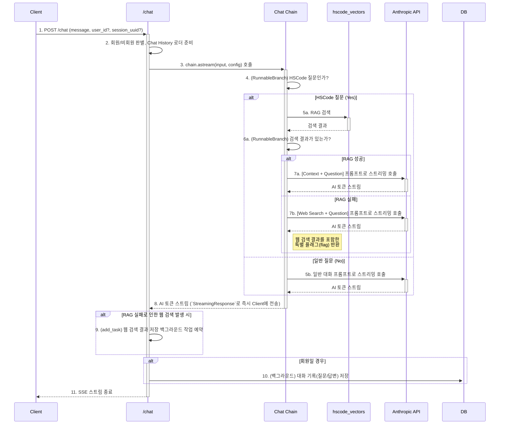

### **`/chat` 엔드포인트 상세 구현 계획서**

**문서 버전:** v1.0
**작성일:** 2024-07-27
**기준 문서:**
1.  `구현계획.md` (vFinal)
2.  `Context7` 리서치 결과 (FastAPI & LangChain)

---

### **1. 기능 목표 (The 'Why')**

`POST /api/v1/chat` 엔드포인트는 플랫폼의 핵심적인 대화형 AI 기능을 제공한다. 이 엔드포인트의 목표는 사용자의 질문을 실시간으로 받아, **1) 회원/비회원 상태와 2) 질문 유형(HSCode/일반)에 따라 최적의 AI 답변 로직을 동적으로 수행**하고, 그 결과를 **서버-전송 이벤트(SSE) 스트림**으로 반환하여 사용자 경험(UX)을 극대화하는 것이다.

주요 책임은 다음과 같다.
- **실시간 응답성:** LangChain의 `astream`과 FastAPI의 `StreamingResponse`를 결합하여 AI가 생성하는 토큰을 지연 없이 클라이언트에 전달한다.
- **대화 맥락 유지:** 로그인한 사용자의 경우, 데이터베이스 기반으로 대화 기록을 관리하여 이전 대화 내용을 기억하고 이어갈 수 있도록 한다 (`RunnableWithMessageHistory`).
- **지식 기반 답변 (RAG):** HSCode 관련 질문 시, 내부 Vector DB를 우선 검색하여 신뢰도 높은 정보를 바탕으로 답변을 생성한다.
- **유연한 정보 검색 (Fallback):** RAG 검색에 실패할 경우, 웹 검색으로 자연스럽게 전환하여 답변을 제공하고, 이 과정에서 얻은 새로운 정보는 비동기 백그라운드 작업(`BackgroundTasks`)으로 Vector DB에 저장하여 시스템의 지식을 점진적으로 확장시킨다.

### **2. 기술 아키텍처 및 데이터 흐름**



### **3. Step-by-Step 구현 상세**

**파일 위치:** `app/api/v1/endpoints/chat.py`

#### **3.1. 의존성 및 초기 설정**

-   **FastAPI:** `APIRouter`, `Depends`, `Request`, `BackgroundTasks`
-   **응답 모델:** `StreamingResponse`
-   **Pydantic 모델:** `ChatRequest`
-   **SQLAlchemy:** `Session`
-   **서비스:** `ChatService`, `LangChainService` (내부적으로 Chat History, RAG, LLM 호출 로직 포함)
-   **CRUD:** `crud.chat_session`, `crud.chat_message`

#### **3.2. 엔드포인트 및 요청 모델 정의**

```python
# app/models/chat_models.py
from pydantic import BaseModel
from typing import Optional

class ChatRequest(BaseModel):
    user_id: Optional[int] = None
    session_uuid: Optional[str] = None
    message: str

# app/api/v1/endpoints/chat.py
router = APIRouter()

@router.post("/chat")
async def handle_chat(
    request: Request,
    chat_request: ChatRequest,
    background_tasks: BackgroundTasks,
    db: Session = Depends(get_db),
    chat_service: ChatService = Depends(get_chat_service) # ChatService 주입
):
    # ... 구현 ...
```

#### **3.3. (Step 2-3) 서비스 호출 및 스트리밍**

-   엔드포인트는 비즈니스 로직을 직접 포함하지 않고, 대부분의 작업을 `ChatService`에 위임한다.
-   `chat_service.stream_chat_response`는 `astream`을 사용하여 비동기 제너레이터를 반환한다.
-   엔드포인트는 이 제너레이터를 `StreamingResponse`로 감싸 클라이언트에 즉시 반환한다.

```python
# app/api/v1/endpoints/chat.py

# ... router.post ...
    generator = await chat_service.stream_chat_response(
        chat_request=chat_request,
        db=db,
        background_tasks=background_tasks
    )
    
    return StreamingResponse(generator, media_type="text/event-stream")
```

#### **3.4. ChatService 및 LangChain 체인 구현 (`app/services/chat_service.py`)**

-   **`ChatService`**: LangChain 체인을 설정하고 실행하는 책임을 진다.

    1.  **`stream_chat_response` 메서드:**
        -   `user_id` 존재 여부로 회원/비회원을 구분한다.
        -   회원인 경우 `RunnableWithMessageHistory`를 사용하여 DB 기반 채팅 기록을 관리하는 체인을 구성한다.
        -   비회원인 경우 `InMemoryChatMessageHistory`를 사용하거나 기록 없이 체인을 구성한다.
        -   구성된 체인의 `astream`을 호출하고, 각 청크(chunk)를 SSE 형식(`data: ...\n\n`)으로 변환하여 `yield`하는 비동기 제너레이터를 구현한다.

    2.  **LangChain 체인 구성 (`_build_chat_chain`):**
        -   **`RunnableBranch`** 를 사용하여 메인 로직을 구성한다.
        -   **(조건 1) `_is_hscode_question`:** `re.search(r'\d{4}\.\d{2}', message)` 와 같은 정규식으로 HSCode 포함 여부를 확인하는 함수.
        -   **(분기 1) RAG 체인:** HSCode 질문일 때 실행된다.
            -   `retriever`: Vector DB에서 관련 문서를 찾는 `VectorStoreRetriever`.
            -   **내부 `RunnableBranch`:**
                -   **(조건) `_has_documents`:** retriever가 문서를 찾았는지 확인.
                -   **(분기) RAG-Success Chain:** 찾은 문서를 컨텍스트로 주입하는 프롬프트 + LLM.
                -   **(기본값) RAG-Fail Chain:** 웹 검색을 수행하는 별도의 체인 (`WebSearchChain`). 이 체인은 결과와 함께 `{"source": "web_search"}` 같은 메타데이터를 반환하도록 설계한다.
        -   **(기본값) 일반 대화 체인:** 간단한 시스템 프롬프트 + LLM으로 구성.

#### **3.5. (Step 9) RAG 실패 시 백그라운드 작업**

-   `stream_chat_response` 제너레이터 내에서 LangChain 체인이 반환하는 청크를 순회한다.
-   만약 청크에 `{"source": "web_search"}`와 같은 메타데이터가 포함되어 있다면, 이는 웹 검색 폴백이 발생했음을 의미한다.
-   이때, `background_tasks.add_task()`를 사용하여 웹 검색 결과를 임베딩하고 DB에 저장하는 별도의 함수(`_save_rag_document_task`)를 호출한다.

```python
# app/services/chat_service.py

async def _save_rag_document_task(content: str, db_session_factory):
    # 중요: background_tasks에 의해 호출되는 함수는 자체 DB 세션을 생성해야 함
    with db_session_factory() as db:
        try:
            # 1. content를 임베딩
            embedding = ... 
            # 2. crud를 사용하여 hscode_vectors에 저장
            crud.hscode.create_with_embedding(db, content=content, embedding=embedding)
            logger.info("Successfully saved new RAG document from web search.")
        except IntegrityError: # UNIQUE 제약 조건 위반 (이미 존재하는 데이터)
            logger.warning("RAG document already exists. Skipping insertion.")
            db.rollback()
        except Exception as e:
            logger.error(f"Failed to save RAG document: {e}")
            db.rollback()

# stream_chat_response 내에서...
final_response_content = ""
web_search_content = ""
async for chunk in chain.astream(...):
    # ... 청크 처리 ...
    final_response_content += chunk.content
    if "source" in chunk.metadata and chunk.metadata["source"] == "web_search":
        web_search_content = chunk.metadata.get("original_content")

    yield f"data: {json.dumps(chunk_for_client)}\n\n"

if web_search_content:
    background_tasks.add_task(_save_rag_document_task, web_search_content, get_db_session_factory) # 세션 팩토리 전달
```

#### **3.6. (Step 10) 회원 대화 기록 저장**

-   `RunnableWithMessageHistory`가 이 부분을 상당 부분 자동화한다.
-   DB와 상호작용하는 커스텀 `BaseChatMessageHistory` 클래스를 구현해야 한다 (`app/services/chat_history_service.py`).
-   이 클래스는 `add_messages`, `messages` 등의 메서드를 구현하며, 내부적으로 `crud.chat_message`를 호출하여 DB에 대화 내용을 저장하고 조회한다.
-   `RunnableWithMessageHistory`는 체인 실행이 끝난 후 자동으로 `add_messages`를 호출하여 대화(사람 질문, AI 답변)를 저장한다.

### **4. 오류 처리 전략**

-   **LLM API 오류:** LangChain의 `.with_fallbacks()` 메커니즘을 사용하여 주력 모델 실패 시 보조 모델을 호출하도록 구성할 수 있다. 또는 `try...except` 블록에서 API 관련 예외를 잡아 사용자에게 "AI 서비스에 문제가 발생했습니다. 잠시 후 다시 시도해주세요."와 같은 표준 에러 메시지를 SSE 스트림으로 전송한다.
-   **DB 오류:**
    -   **대화 기록 저장 실패:** 이는 치명적인 오류는 아니다. 오류를 로깅하되, 사용자에게는 답변 스트림이 정상적으로 전송되도록 한다.
    -   **RAG 문서 저장 실패 (백그라운드):** `_save_rag_document_task` 내에서 모든 예외를 처리하고 로깅한다. `UNIQUE` 제약 조건 위반은 정상적인 케이스로 간주하고 경고만 로깅한다. 이 작업의 실패가 사용자 경험에 영향을 주지 않아야 한다.
-   **요청 유효성 검사:** FastAPI와 Pydantic이 자동으로 처리하며, 잘못된 요청은 `422 Unprocessable Entity` 응답을 반환한다.

### **5. 결론**

이 계획은 `구현계획.md`의 요구사항과 `Context7` 리서치를 통해 검증된 최신 기술 스택을 결합하여, **확장 가능하고, 안정적이며, 유지보수가 용이한** 채팅 엔드포인트를 구현하기 위한 구체적인 청사진이다. 각 컴포넌트의 책임을 명확히 분리하고, 비동기 처리와 오류 처리 전략을 구체화하여 고품질의 코드를 작성하는 기반을 제공한다. 