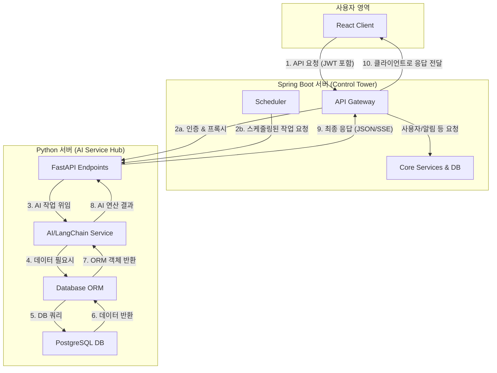

**문서 목표:** React 클라이언트, Spring Boot 컨트롤 타워, Python AI 허브로 구성된 플랫폼의 아키텍처를 최종 확정한다. 특히 각 서버의 역할, API 명세, 핵심 로직의 데이터 흐름, 예외 처리 방안을 누구나 이해할 수 있도록 시각적 자료와 함께 상세히 기술한다.

-----

### **1. 최종 시스템 아키텍처 및 데이터 흐름**

#### **1.1. 컴포넌트별 역할 정의**

  * **React Client:** 사용자 인터페이스(UI)를 제공합니다. 모든 사용자 요청(채팅, 데이터 조회 등)을 Spring Boot 서버의 API 게이트웨이로 전송하는 시작점입니다.
  * **Spring Boot Server (Control Tower):**
      * **API Gateway:** 모든 클라이언트 요청의 단일 진입점입니다. JWT 기반 사용자 인증, 요청 유효성 검사, 라우팅을 수행합니다. AI 기능이 필요한 요청은 Python 서버로 안전하게 프록시(proxy)합니다.
      * **Scheduler (`@Scheduled`):** 주기적인 백그라운드 작업을 총괄합니다. 정해진 시간에 Python 서버의 특정 API(뉴스 생성, 북마크 모니터링)를 호출하여 작업을 '지시'합니다.
      * **Core Services:** 사용자 관리, 알림(SMS/Email) 발송 등 비즈니스 로직의 핵심을 담당합니다.
  * **Python FastAPI Server (AI Service Hub):**
      * 플랫폼의 모든 AI 연산 및 데이터 관련 중작업(heavy-lifting)을 전담합니다.
      * 자체적인 스케줄러나 사용자 인증 로직 없이, 오직 Spring Boot로부터 받은 명시적인 API 요청에만 응답하는 **온디맨드 서비스**로 동작합니다.

#### **1.2. 고수준 아키텍처 다이어그램**



#### **1.3. 상세 요청 시퀀스 다이어그램 (회원 채팅 예시)**

```mermaid
sequenceDiagram
    participant RC as React Client
    participant SB as Spring Boot
    participant PY as Python (FastAPI)
    participant Claude as Anthropic API

    RC->>+SB: POST /api/chat (JWT 헤더, 메시지 본문)
    SB->>SB: 1. JWT 토큰 검증, user_id 추출
    SB->>+PY: 2. POST /chat (Request Body에 user_id, 메시지 포함)
    PY->>PY: 3. user_id 존재 확인 (회원)
    PY->>PY: 4. RAG 검색 (hscode_vectors)
    alt RAG 검색 성공
        PY->>+Claude: 5a. 검색된 컨텍스트 + 질문 전달
        Claude-->>-PY: 6a. AI 답변 스트림 생성
        PY-->>-SB: 7a. SSE 스트림 반환
        Note right of PY: 백그라운드에서<br/>chat_messages 저장
    else RAG 검색 실패
        PY->>+Claude: 5b. 웹 검색 프롬프트 + 질문 전달
        Claude-->>-PY: 6b. 웹 검색 기반 답변 스트림 생성
        PY-->>-SB: 7b. SSE 스트림 반환
        Note right of PY: (응답 후 비동기) 검색 결과<br/>임베딩 및 hscode_vectors 저장 시도
    end
    SB-->>-RC: 8. SSE 스트림 중계
```

-----

### **2. Python 서버 기술 스택 및 구성**

#### **2.1. 기술 스택 및 도입 사유**

  * **프레임워크 (`FastAPI`):** ASGI 기반의 고성능 웹 프레임워크로, 비동기 처리를 지원하여 I/O bound 작업(API 호출, DB 조회)이 많은 AI 서비스에 최적입니다. Pydantic을 이용한 자동 유효성 검사 및 OpenAPI 문서 생성 기능은 개발 생산성을 극대화합니다.
  * **DB ORM (`SQLAlchemy`):** 파이썬의 표준 ORM으로, 복잡한 SQL 쿼리를 파이썬 코드로 관리할 수 있게 하여 코드의 가독성과 유지보수성을 높입니다. DB 벤더에 대한 종속성을 줄여줍니다.
  * **AI/LLM (`LangChain`, `langchain-anthropic`):** LLM 애플리케이션 개발을 위한 통합 프레임워크입니다. RAG, 프롬프트 관리, 모델 연동 등 복잡한 AI 로직을 표준화된 인터페이스로 구현할 수 있습니다.
  * **로깅 (`logging`):** 파이썬 표준 라이브러리로, 설정이 유연하고 강력합니다. \*\*날짜별로 로그 파일을 생성(`TimedRotatingFileHandler`)\*\*하여 관리를 용이하게 합니다.

#### **2.2. 내부 컴포넌트 구성도**

```mermaid
graph TD
    subgraph "FastAPI Application"
        A[Endpoints (api/v1/)]
        B[Services (langchain_service, db_service)]
        C[Models (Pydantic & SQLAlchemy)]
        D[Core (db_session, logging)]
    end

    E[PostgreSQL DB]

    A -- 의존성 주입 --> B
    B -- ORM 모델 사용 --> C
    B -- DB 세션 사용 --> D
    D -- DB 연결 --> E
```

#### **2.3. 설정 및 로깅 전략**

  * **설정 관리:** 데이터베이스 접속 정보, Anthropic API 키 등 민감한 정보는 `.env` 파일에 정의하고, `python-dotenv` 라이브러리를 통해 애플리케이션 실행 시 환경변수로 로드합니다. 절대로 소스 코드에 하드코딩하지 않습니다.
  * **로깅 구현:**
      * 파이썬의 `logging` 모듈을 설정합니다.
      * `TimedRotatingFileHandler`를 사용하여 `logs/app.log` 형태로 매일 자정에 새 로그 파일이 생성되도록 합니다.
      * 로그 형식(formatter)에 타임스탬프, 로그 레벨, 모듈 이름, 메시지가 포함되도록 하여 디버깅을 용이하게 합니다.

-----

### **3. 핵심 기능 API 상세 명세**

#### **3.1. 실시간 채팅 API (`POST /chat`)**

  * **역할:** 사용자의 질문에 대해 RAG 또는 웹 검색을 통해 답변을 생성하고, 실시간 스트리밍(SSE)으로 응답합니다. 회원/비회원 여부에 따라 채팅 내역 저장 로직을 분기합니다.

  * **핵심 로직 순서도:**

    ```mermaid
    flowchart TD
        A[POST /chat 요청 수신] --> B{Request Body에 user_id가 있는가?};
        B -- Yes (회원) --> C[DB에 chat_session 생성/조회];
        B -- No (비회원) --> D[메모리에서만 처리];
        C --> E{HSCode 관련 질문인가?};
        D --> E;
        E -- Yes --> F[1. hscode_vectors에서 RAG 검색];
        E -- No --> G[일반 대화 프롬프트로 Claude 호출];
        F --> H{RAG 검색 성공?};
        H -- Yes --> I[검색된 정보와 함께 Claude 호출];
        H -- No --> J[RAG 실패 처리];
        J --> K[2. 웹 검색으로 Claude 호출];
        J --> L[3. (백그라운드) 검색결과 임베딩 & DB 저장 시도];
        K --> M[AI 답변 생성];
        I --> M;
        G --> M;
        M --> N{user_id가 있는가?};
        N -- Yes (회원) --> O[chat_messages에 대화 저장];
        N -- No (비회원) --> P[저장 안함];
        O --> Q[SSE 스트림으로 응답 전송];
        P --> Q;
    ```

  * **RAG 실패 시 비동기 처리 시퀀스 다이어그램:**

    ```mermaid
    sequenceDiagram
        participant User
        participant FastAPI
        participant Claude
        participant DB

        User->>FastAPI: HSCode '1234.56' 질문 (RAG 실패)
        FastAPI->>Claude: '1234.56' 웹 검색 요청
        Claude-->>FastAPI: 검색 결과 기반 답변 스트림
        FastAPI-->>User: 1. SSE 스트림으로 즉시 응답 시작 (지연 최소화)
        
        par "백그라운드 작업"
            FastAPI->>Claude: 2. 검색 결과 텍스트 임베딩 요청
            Claude-->>FastAPI: 임베딩 벡터 반환
            FastAPI->>DB: 3. INSERT INTO hscode_vectors VALUES ('1234.56', '...', embedding)
            alt "hscode가 이미 존재 (UNIQUE 제약 위반)"
                DB-->>FastAPI: Insert Error
                FastAPI->>FastAPI: 4a. 에러 로깅 후 정상 종료 (무시)
            else "삽입 성공"
                DB-->>FastAPI: Insert Success
                FastAPI->>FastAPI: 4b. 성공 로깅
            end
        end
    ```

  * **요청/응답 모델 (Python Pydantic)**

    ```python
    from pydantic import BaseModel
    from typing import Optional, List

    class ChatRequest(BaseModel):
        user_id: Optional[int] = None # 회원이면 ID, 비회원이면 null
        session_uuid: Optional[str] = None
        message: str
        
    class ChatResponse(BaseModel):
        # SSE는 별도 핸들러로 처리되므로, 이 모델은 일반 응답용
        status: str
        message: str
    ```

#### **3.2. 온디맨드 뉴스 생성 API (`POST /trade-news`)**

  * **역할:** Spring Boot 스케줄러의 요청에 따라, AI를 이용해 최신 무역 뉴스를 웹에서 검색하고, 요약/분류하여 `trade_news` 테이블에 저장합니다.

  * **로직 순서도:**

    ```mermaid
    flowchart TD
        A[POST /trade-news 요청 수신] --> B[LangChain 서비스 호출];
        B --> C[Claude에 웹 검색 및 JSON 생성 프롬프트 전달];
        C --> D[Claude가 웹 검색 후 구조화된 JSON 응답 반환];
        D --> E{JSON 파싱 성공?};
        E -- Yes --> F[JSON 리스트 순회];
        F --> G[각 뉴스 항목을 trade_news 테이블에 저장];
        G --> F;
        F -- 완료 --> H[성공 응답 반환 (생성된 뉴스 개수 포함)];
        E -- No --> I[에러 로깅 및 실패 응답 반환];
    ```

  * **DB 상호작용:** AI가 생성한 JSON 객체의 각 필드(`title`, `summary`, `source_name`, `published_at`, `category`, `priority` 등)는 `trade_news` 테이블의 해당 컬럼에 정확히 매핑되어 저장됩니다.

#### **3.3. 온디맨드 북마크 모니터링 API (`POST /run-monitoring`)**

  * **역할:** Spring Boot 스케줄러의 요청에 따라, 알림이 활성화된 모든 사용자 북마크에 대해 최신 정보를 AI로 검색하고, 변경사항이 감지되면 `update_feeds` 테이블에 기록합니다.

  * **로직 순서도:**

    ```mermaid
    flowchart TD
        A[POST /run-monitoring 요청 수신] --> B[DB에서 monitoring_active=true인 모든 bookmarks 조회];
        B --> C{활성 북마크가 있는가?};
        C -- Yes --> D[북마크 리스트 순회 시작];
        D --> E["'target_value' 관련 최신 정보" 동적 프롬프트 생성];
        E --> F[Claude 웹 검색 호출];
        F --> G{유의미한 업데이트가 있는가?};
        G -- Yes --> H[update_feeds 테이블에 요약 내용 저장];
        G -- No --> I[다음 북마크로 이동];
        H --> I;
        I --> D;
        D -- 완료 --> J[성공 응답 반환 (모니터링 개수, 업데이트 개수 포함)];
        C -- No --> K[작업 없이 성공 응답 반환];
    ```

-----

### **4. Spring Boot 연동 상세 방안**

  * **역할:** Spring Boot의 `BackgroundJobScheduler`는 Python 서버의 백그라운드 작업을 트리거하는 유일한 주체입니다. `WebClient`를 사용하여 비동기 HTTP 요청을 보냅니다.

  * **스케줄러 연동 시퀀스 다이어그램 (뉴스 생성 예시):**

    ```mermaid
    sequenceDiagram
        participant Scheduler as Spring Scheduler
        participant WebClient as Spring WebClient
        participant FastAPI as Python Server

        loop 매시간 정각
            Scheduler->>Scheduler: @Scheduled(cron="0 0 * * * *")
            Scheduler->>WebClient: triggerNewsGeneration() 호출
            WebClient->>FastAPI: POST /trade-news
            activate FastAPI
            FastAPI->>FastAPI: 뉴스 생성 작업 수행
            FastAPI-->>WebClient: {"status": "success", "count": 5}
            deactivate FastAPI
            WebClient->>Scheduler: Mono<String> 결과 반환
            Scheduler->>Scheduler: 결과 로깅 (doOnSuccess/doOnError)
        end
    ```

  * **상세 연동 코드 (Kotlin)**

    ```kotlin
    import org.springframework.scheduling.annotation.Scheduled
    import org.springframework.stereotype.Component
    import org.springframework.web.reactive.function.client.WebClient
    import org.slf4j.LoggerFactory

    @Component
    class BackgroundJobScheduler(private val webClient: WebClient) {

        private val logger = LoggerFactory.getLogger(javaClass)
        private val pythonServerUrl = "http://python-fastapi-server:8000"

        // 매시간 정각에 뉴스 생성 요청
        @Scheduled(cron = "0 0 * * * *", zone = "Asia/Seoul")
        fun triggerNewsGeneration() {
            logger.info("Triggering news generation task...")
            webClient.post()
                .uri("$pythonServerUrl/trade-news")
                .retrieve()
                .bodyToMono(String::class.java)
                .doOnSuccess { result -> logger.info("News generation task requested successfully: $result") }
                .doOnError { e -> logger.error("Failed to request news generation task", e) }
                .subscribe() // 비동기 실행을 위해 반드시 호출
        }

        // 매일 새벽 5시에 모니터링 요청
        @Scheduled(cron = "0 0 5 * * *", zone = "Asia/Seoul")
        fun triggerBookmarkMonitoring() {
            logger.info("Triggering bookmark monitoring task...")
            webClient.post()
                .uri("$pythonServerUrl/run-monitoring")
                .retrieve()
                .bodyToMono(String::class.java)
                .doOnSuccess { result -> logger.info("Bookmark monitoring task requested successfully: $result") }
                .doOnError { e -> logger.error("Failed to request bookmark monitoring task", e) }
                .subscribe()
        }
    }
    ```

-----

### **5. 최종 결론**

이 아키텍처는 각 서버의 책임을 명확하게 분리하여 기술적 복잡도를 낮추고 유지보수성을 극대화합니다.

  * **아키텍처의 강점:**
    ```mermaid
    mindmap
      root((분리된 아키텍처의 강점))
        ::icon(fa fa-cogs)
        단순성 & 예측 가능성
          ::icon(fa fa-check-circle)
          Python은 AI/데이터 작업만 집중
          Spring은 비즈니스 로직/제어만 집중
        중앙 집중 제어
          ::icon(fa fa-broadcast-tower)
          모든 백그라운드 작업은 Spring Scheduler가 지휘
          시스템 전체 동작 파악 용이
        독립적 확장성
          ::icon(fa fa-expand-arrows-alt)
          AI 연산 부하 증가 시 Python 서버만 증설
          Spring 서버는 영향 없음
    ```

이 최종 전략서는 프로젝트의 성공적인 완수를 위한 명확한 청사진을 제공합니다. 이 계획에 따라 개발을 진행하면, 기술적으로 정제되고 안정적이며, 향후 확장이 용이한 고품질 플랫폼을 구축할 수 있을 것입니다.